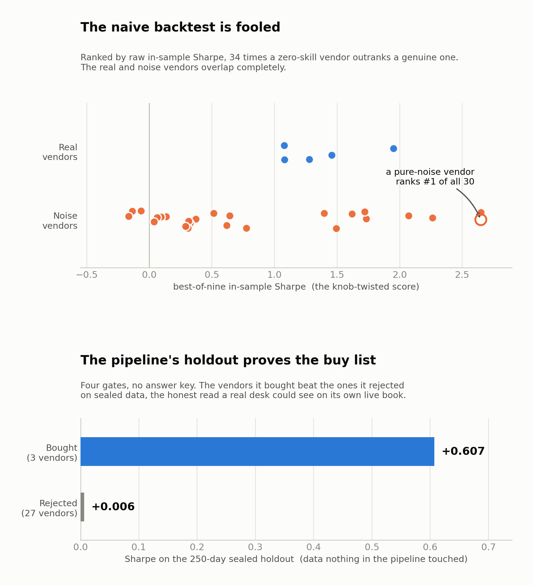
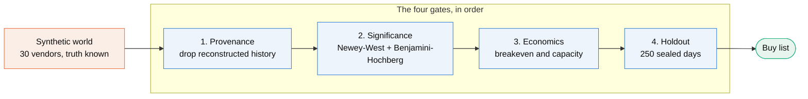

<h1 align="center">AltSignal</h1>

<p align="center">
  <em>A validation harness that separates alternative-data vendors with real predictive power<br/>
  from ones that merely got lucky, proven on synthetic data where the truth is known.</em>
</p>

<p align="center">
  
  
  
  
</p>

All data here is synthetic and generated locally from a fixed seed. Nothing touches a real vendor
or a licensed feed. That is deliberate: a harness that decides which vendors genuinely predict
returns can only be trusted once it has been validated on data whose true answer is known in
advance. The generators build a shortlist of candidate vendors, a handful with real skill and the
rest pure noise, and the chosen list of true information coefficients is the answer key the harness
is graded against but never allowed to read while deciding.

## Demo: one seed, start to finish

The naive backtest a rushed analyst would run gets fooled. The full pipeline does not, and it
proves the difference on data it never saw. Both panels below are real output on the default
seed 42.



The bottom panel is the whole point. On 250 days nothing in the pipeline ever touched, the vendors
it bought return a Sharpe of **+0.607** while the ones it rejected return **+0.006**. A desk
running this process would see that gap on its own live book, with no answer key, and know the buy
list was real. The naive backtest, which crowned a pure-noise vendor, could never give it that.

<details>
<summary><b>See the raw console output</b> (the three commands behind the picture)</summary>

```console
$ python -m src.generate
STEP 1 SANITY CHECKS   (seed = 42, 30 vendors, 5 real = 17% base rate)
  panel-wide daily vol   0.0181   (want ~0.018-0.022)
  annualised vol         28.7%   (want ~28-35%)
  mean pairwise corr     0.325   (want ~0.25-0.35)
  factor persistences    [0.97 0.89 0.8  0.72 0.63 0.55]   (slow -> fast)

$ python -m src.naive
SUMMARY
  top-ranked vendor overall:   vendor_22 -> fake  (best_sharpe 2.65)
  fake-over-real inversions:   34   (zero-skill vendors outranking genuine ones)
  mean best-minus-single gap:  0.34   (the cost of knob-twisting)

$ python -m src.pipeline
GATE BY GATE   (30 vendors in, 5 of them real)
  1 provenance   8489 vendor-days of reconstructed history discarded
  2 significance 5 survive, 60% real
  3 economics    3 survive, 67% real
  4 holdout      bought +0.607   rejected +0.006
  recall: 40% of the real vendors found
```

Numbers move seed to seed, which is the point: run any module with `--sweep N` for the
distribution rather than one lucky or unlucky draw. Regenerate the figure with
`python -m docs.make_figures`.
</details>

## The pipeline

Four gates run in order, cheapest and most powerful first, each narrowing what the next may look
at. Gate order is enforced structurally, not by convention, and no gate ever reads the answer key.



1. **Provenance.** A vendor that discloses a live-start date is scored only on data after it.
   Reconstructed history is not evidence. This runs first because it changes the data every later
   gate sees.
2. **Significance.** A Newey-West p-value on the turnover-controlled ensemble book, then
   Benjamini-Hochberg across vendors. It controls the fraction of the buy list that is junk, the
   right framing when you are buying five things, not promising to never be wrong.
3. **Economics.** Breakeven cost and capacity on a turnover-controlled book. It kills vendors that
   are real but cannot pay for their own trading.
4. **Holdout.** The final 250 days are sealed before gate 1 runs and opened once, after the buy
   list is fixed.

The output that matters is not accuracy, since the answer key gives that away. It is whether the
holdout would have told a desk the same thing without an answer key.

## The two worlds

The harness runs against two synthetic worlds, each with a fixed seed and a disclosed answer key.

- **Return-driven world** (`src/generate.py`). 400 assets, 1500 days, a sticky market factor, six
  style factors each with its own persistence (fast mean-reversion through slow trend), and
  fat-tailed returns. Thirty vendors: five real with information coefficients compressed into 0.010
  to 0.030, and twenty-five nulls, a 1-in-6 base rate that mirrors a real shortlist. Each real
  vendor reads a different factor, so vendors with identical IC still differ in decay and turnover.
  Some vendors ship reconstructed ("backfilled") history with a disclosed live-start date,
  including one real vendor so that "has backfill" is not a synonym for "fake".
- **Unified world** (`src/world.py`). The same returns plus a fundamentals layer: quarterly
  revenue, consensus estimates, and per-vendor nowcasts. It adds mirror vendors that track
  consensus almost perfectly, so they are the most accurate vendors in the shortlist and worth
  nothing, because everything they know is already in the price. They exist to break any gate that
  filters on accuracy alone.

`src/pipeline2.py` runs the same worlds twice, changing only what gate 2 reads: return-based
p-values versus a fundamentals test that requires both accuracy against reported revenue and
incremental value over consensus. That second condition is what removes the mirror vendors.

## Run it

```bash
pip install numpy pandas scipy matplotlib
python -m src.generate            # build the return-driven world into data/, print the sanity block
python -m src.pipeline            # the four-gate buy list on seed 42, writes results/pipeline.csv
python -m src.pipeline --sweep 30 # the same across 30 seeds, writes results/pipeline_sweep.csv
python -m src.pipeline2           # returns vs fundamentals gate, writes results/pipeline2.csv
python -m docs.make_figures       # regenerate docs/demo.png from live output
```

Each analysis module also runs on its own with `python -m src.<name>` and writes its own table into
`results/`. Most take a `--sweep N` flag. Generation is deterministic: same seed in, byte-identical
arrays out.

## The modules

<details>
<summary><b>Twenty-one modules, grouped by the question each answers</b></summary>

```
src/
  generate.py      return-driven world: the universe and the 30-vendor shortlist   (Step 1)
  world.py         unified world: the above plus the fundamentals and mirror layer
  naive.py         the deliberately wrong baseline: no split, keep the best of nine configs  (Step 2)
  walkforward.py   purged walk-forward validation with an embargo   (Step 3)
  ensemble.py      the alternative to selection: stop picking a config, average all nine   (Step 3)
  significance.py  Newey-West, Benjamini-Hochberg, deflated Sharpe: pay for your searches   (Step 4)
  pbo.py           Probability of Backtest Overfitting, combinatorially symmetric cross-validation
  reality_check.py White's Reality Check, Hansen's SPA, Romano-Wolf stepdown
  gate_sweep.py    what the decision rule costs: sweeping gate 2 instead of assuming it
  turnover.py      turnover control, so the book is not rebuilding itself every three days
  decay.py         signal decay and transaction costs: why statistically real vendors still fail
  capacity.py      capacity: dropping the infinite-liquidity assumption
  backfill.py      backfill detection, the highest-powered test in the harness, and it uses no statistics
  changepoint.py   finding the backfill seam without being told where it is
  holdout.py       the true holdout: what the whole pipeline is worth on data it never saw
  triangulate.py   cross-vendor triangulation: consistency without any ground truth
  fundamentals.py  scoring vendors against what they actually measure
  event_book.py    trading a quarterly signal the way a real earnings desk does
  robustness.py    multi-seed harness that wraps any scorer
  pipeline.py      the four-gate buy list, return-driven world
  pipeline2.py     the same, comparing a returns gate against a fundamentals gate

data/              generated, gitignored (returns.npy, vendors.npz, answer_key.csv)
results/           one CSV per module, plus the *_sweep.csv multi-seed summaries
docs/              the demo figure and the script that builds it
NOTES.md           design notes for the generator and the two tensions in the original spec
```
</details>

## Read NOTES.md for the generator design

The generator makes a few deliberate departures from a naive IC-injection recipe, and two of the
original spec's acceptance targets turned out to be mathematically in tension. The short version:
the Sharpe level of a backtest is governed by the effective breadth of the book, not by any
noise-correlation knob, and a null vendor that can look good in sample must carry some spurious
in-sample IC, so it cannot both look convincing downstream and have a near-zero realised IC.
[`NOTES.md`](NOTES.md) works through both.
